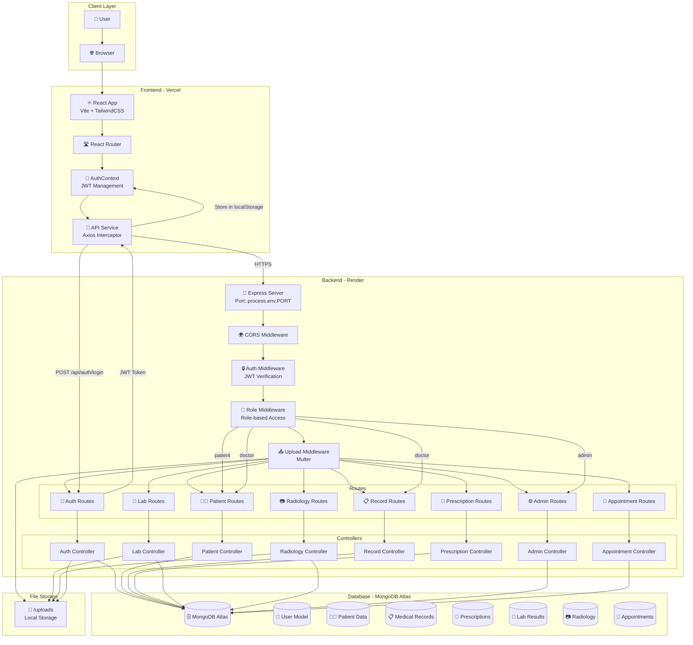
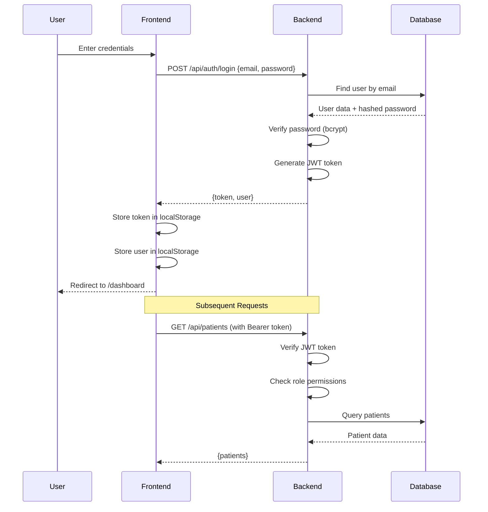
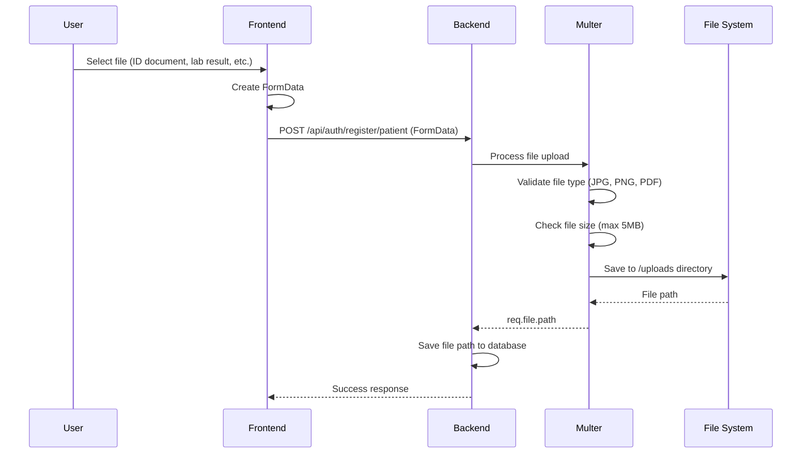

# 🔍 Unified Medical Record System (UMR) — Complete Technical Audit Report

**Date:** January 2026  
**Project:** Unified Medical Record System (UMR)  
**Tech Stack:** MERN (MongoDB, Express, React, Node.js)  
**Deployment:** Frontend (Vercel) | Backend (Render) | Database (MongoDB Atlas)

---

## 📋 Table of Contents

1. [System Architecture Diagram](#1-system-architecture-diagram)
2. [Complete API Map](#2-complete-api-map)
3. [Project Architecture Overview](#3-project-architecture-overview)
4. [MERN Integration Issues](#4-mern-integration-issues)
5. [Deployment Verification](#5-deployment-verification)
6. [Branding Migration Status](#6-branding-migration-status)
7. [Security Audit](#7-security-audit)
8. [Stability Check](#8-stability-check)
9. [Recommended Improvements](#9-recommended-improvements)

---

## 1️⃣ System Architecture Diagram



### Authentication Flow



### File Upload Flow



---

## 2️⃣ Complete API Map

### 🔑 Authentication Endpoints

| Method | Path | Controller | Auth Required | Role Required | Request Body | Response |
|--------|------|------------|---------------|---------------|--------------|----------|
| POST | `/api/auth/register/patient` | `authController.registerPatient` | ❌ No | None | `FormData: {fullName, email, password, nationalId, phoneNumber, gender, mothersName, idDocument}` | `{message: "تم تسجيل المريض بنجاح!"}` |
| POST | `/api/auth/register/doctor` | `authController.registerDoctor` | ❌ No | None | `FormData: {fullName, email, password, nationalId, phoneNumber, gender, syndicateNumber, syndicateId}` | `{message: "تم تسجيل الطبيب بنجاح!"}` |
| POST | `/api/auth/login` | `authController.login` | ❌ No | None | `{email, password}` | `{message, token, user: {id, fullName, email, role}}` |
| GET | `/api/auth/me` | `authRoutes` (inline) | ✅ Yes | Any | None | `{user: {id, fullName, email, role}}` |

### 👨‍⚕️ Patient Endpoints

| Method | Path | Controller | Auth Required | Role Required | Request Body | Response |
|--------|------|------------|---------------|---------------|--------------|----------|
| POST | `/api/patients` | `patientController.createPatient` | ✅ Yes | `doctor`, `admin` | `{fullName, nationalId, phoneNumber, gender}` | `{message, patient}` |
| GET | `/api/patients` | `patientController.getPatients` | ✅ Yes | `doctor`, `admin` | Query: `?search=&page=&limit=` | `{patients[], total, page, totalPages}` |
| GET | `/api/patients/:id` | `patientController.getPatientById` | ✅ Yes | `doctor`, `admin`, or `patient` (self) | None | `{patient object}` |
| PUT | `/api/patients/:id` | `patientController.updatePatient` | ✅ Yes | `patient` (self) or `admin` | `{fullName?, phoneNumber?, bloodType?, allergies?, chronicDiseases?, dateOfBirth?}` | `{message, patient}` |
| DELETE | `/api/patients/:id` | `patientController.deletePatient` | ✅ Yes | `admin` | None | `{message}` |

### 📋 Medical Records Endpoints

| Method | Path | Controller | Auth Required | Role Required | Request Body | Response |
|--------|------|------------|---------------|---------------|--------------|----------|
| POST | `/api/records` | `recordController.createRecord` | ✅ Yes | `doctor` | `{patientId, diagnosis, notes, visitDate}` | `{message, record}` |
| GET | `/api/records/patient/:patientId` | `recordController.getRecordsByPatient` | ✅ Yes | `doctor`, `admin`, or `patient` (self) | None | `{records[]}` |
| GET | `/api/records/:patientId` | `recordController.getRecordsByPatient` | ✅ Yes | `doctor`, `admin`, or `patient` (self) | None | `{records[]}` |

### 💊 Prescription Endpoints

| Method | Path | Controller | Auth Required | Role Required | Request Body | Response |
|--------|------|------------|---------------|---------------|--------------|----------|
| POST | `/api/prescriptions` | `prescriptionController.createPrescription` | ✅ Yes | `doctor` | `{patientId, medication, dose, duration}` | `{message, prescription}` |
| GET | `/api/prescriptions/:patientId` | `prescriptionController.getPrescriptionsByPatient` | ✅ Yes | `doctor`, `admin`, or `patient` (self) | None | `{prescriptions[]}` |
| PUT | `/api/prescriptions/:id/dispense` | `prescriptionController.dispensePrescription` | ✅ Yes | `admin` | None | `{message, prescription}` |

### 🧪 Lab Results Endpoints

| Method | Path | Controller | Auth Required | Role Required | Request Body | Response |
|--------|------|------------|---------------|---------------|--------------|----------|
| POST | `/api/labs` | `labController.createLabResult` | ✅ Yes | `doctor`, `admin` | `FormData: {patientId, testName, result, date, labName, labFile}` | `{message, labResult}` |
| GET | `/api/labs` | `labController.getLabResults` | ✅ Yes | Any (filtered by role) | Query: `?patientId=` | `{labs[]}` |
| DELETE | `/api/labs/:id` | `labController.deleteLabResult` | ✅ Yes | `doctor`, `admin` | None | `{message}` |

### 📷 Radiology Endpoints

| Method | Path | Controller | Auth Required | Role Required | Request Body | Response |
|--------|------|------------|---------------|---------------|--------------|----------|
| POST | `/api/radiology` | `radiologyController.createRadiology` | ✅ Yes | `doctor`, `admin` | `FormData: {patientId, scanType, report, date, radiologyFile}` | `{message, radiology}` |
| GET | `/api/radiology` | `radiologyController.getRadiologyResults` | ✅ Yes | Any (filtered by role) | Query: `?patientId=` | `{radiology[]}` |
| DELETE | `/api/radiology/:id` | `radiologyController.deleteRadiology` | ✅ Yes | `doctor`, `admin` | None | `{message}` |

### ⚙️ Admin Endpoints

| Method | Path | Controller | Auth Required | Role Required | Request Body | Response |
|--------|------|------------|---------------|---------------|--------------|----------|
| GET | `/api/admin/doctors` | `adminController.getDoctors` | ✅ Yes | `admin` | None | `{doctors[]}` |
| PUT | `/api/admin/verify-doctor/:id` | `adminController.verifyDoctor` | ✅ Yes | `admin` | None | `{message, doctor}` |
| DELETE | `/api/admin/user/:id` | `adminController.deleteUser` | ✅ Yes | `admin` | None | `{message}` |

### 📅 Appointment Endpoints

| Method | Path | Controller | Auth Required | Role Required | Request Body | Response |
|--------|------|------------|---------------|---------------|--------------|----------|
| GET | `/api/appointments` | `appointmentController.getAppointments` | ✅ Yes | Any (filtered by role) | None | `{appointments[]}` |
| POST | `/api/appointments` | `appointmentController.createAppointment` | ✅ Yes | `patient` | `{doctorId, date, time, notes}` | `{message, appointment}` |
| PUT | `/api/appointments/:id` | `appointmentController.updateAppointment` | ✅ Yes | Owner or `admin` | `{status?, notes?}` | `{message, appointment}` |

### 🏥 Health Check

| Method | Path | Controller | Auth Required | Response |
|--------|------|------------|---------------|----------|
| GET | `/api/health` | Inline handler | ❌ No | `{status: "OK", service: "UMR Backend", time}` |

---

## 3️⃣ Project Architecture Overview

### Frontend Structure (`frontend/`)

```
frontend/
├── src/
│   ├── main.jsx                    # Entry point
│   ├── App.jsx                     # Root component (AuthProvider + Router + Toaster)
│   ├── index.css                   # Global styles + Tailwind
│   │
│   ├── lib/
│   │   └── utils.js                # Utility functions (cn helper)
│   │
│   ├── services/
│   │   └── api.js                  # Axios instance with JWT interceptor
│   │
│   ├── context/
│   │   └── AuthContext.jsx         # Global auth state management
│   │
│   ├── router/
│   │   └── AppRouter.jsx           # React Router with route guards
│   │
│   ├── components/
│   │   ├── layout/
│   │   │   ├── DashboardLayout.jsx # Sidebar + Header layout
│   │   │   └── MainLayout.jsx      # Alternative layout
│   │   ├── modals/
│   │   │   ├── AddPatientModal.jsx
│   │   │   ├── AddPrescriptionModal.jsx
│   │   │   └── AddVisitModal.jsx
│   │   └── ui/                     # Reusable UI components (shadcn/ui style)
│   │       ├── button.jsx
│   │       ├── card.jsx
│   │       ├── input.jsx
│   │       ├── select.jsx
│   │       ├── table.jsx
│   │       └── ...
│   │
│   └── pages/
│       ├── HomePage.jsx            # Public landing page
│       ├── LoginPage.jsx           # Login form
│       ├── Register.jsx            # Registration form
│       ├── DashboardPage.jsx       # Role-based dashboard
│       ├── PatientPage.jsx         # Patient dashboard
│       ├── DoctorPage.jsx          # Doctor dashboard
│       ├── HospitalPage.jsx        # Hospital dashboard
│       ├── LabPage.jsx             # Lab dashboard
│       ├── AdminPage.jsx           # Admin dashboard
│       ├── ProfilePage.jsx         # User profile
│       ├── PatientProfile.jsx      # Patient detail view
│       ├── Patients.jsx            # Patient list
│       ├── Labs.jsx                # Lab results page
│       ├── Medications.jsx        # Prescriptions page
│       └── Consents.jsx            # Consents page
│
├── public/                         # Static assets
├── dist/                           # Build output
├── vite.config.js                  # Vite configuration
├── tailwind.config.js              # Tailwind CSS config
├── vercel.json                     # Vercel deployment config
└── package.json                    # Dependencies
```

**Layer Responsibilities:**

- **Pages:** Route-level components, handle data fetching and business logic
- **Components:** Reusable UI components and layout wrappers
- **Context:** Global state management (authentication)
- **Services:** API communication layer (Axios with interceptors)
- **Router:** Route definitions and protection (auth guards, role guards)

### Backend Structure (`backend/`)

```
backend/
├── server.js                       # Express app entry point
│
├── routes/                         # Route definitions
│   ├── authRoutes.js              # Authentication routes
│   ├── patientRoutes.js           # Patient CRUD routes
│   ├── recordRoutes.js            # Medical records routes
│   ├── prescriptionRoutes.js      # Prescription routes
│   ├── labRoutes.js               # Lab results routes
│   ├── radiologyRoutes.js         # Radiology routes
│   ├── adminRoutes.js             # Admin routes
│   └── appointmentRoutes.js       # Appointment routes
│
├── controllers/                    # Business logic
│   ├── authController.js          # Login, register logic
│   ├── patientController.js       # Patient operations
│   ├── recordController.js        # Medical record operations
│   ├── prescriptionController.js   # Prescription operations
│   ├── labController.js           # Lab result operations
│   ├── radiologyController.js     # Radiology operations
│   ├── adminController.js         # Admin operations
│   └── appointmentController.js    # Appointment operations
│
├── models/                         # Mongoose schemas
│   ├── User.js                    # User model (all roles)
│   ├── MedicalRecord.js           # Medical record model
│   ├── Prescription.js            # Prescription model
│   ├── LabResult.js               # Lab result model
│   ├── Radiology.js               # Radiology model
│   └── Appointment.js             # Appointment model
│
├── middleware/                     # Express middleware
│   ├── auth.js                    # JWT verification
│   ├── role.js                    # Role-based access control
│   └── upload.js                  # Multer file upload config
│
├── uploads/                        # File storage directory
├── scripts/
│   └── seedAdmin.js               # Admin user seeding script
└── package.json                    # Dependencies
```

**Layer Responsibilities:**

- **Routes:** Define HTTP endpoints and apply middleware
- **Controllers:** Handle request/response, call models, business logic
- **Models:** Database schemas and Mongoose models
- **Middleware:** Authentication, authorization, file uploads
- **Server:** Express app setup, CORS, static files, route mounting

---

## 4️⃣ MERN Integration Issues

### 🔴 Critical Issues

#### CRIT-01: Port Mismatch Between Backend and Frontend Proxy
**Location:** `backend/server.js` (line 120) vs `frontend/vite.config.js` (line 17)

**Problem:**
- Backend runs on port `3000` (default: `process.env.PORT || 3000`)
- Vite proxy targets port `5000` (`target: 'http://localhost:5000'`)
- Frontend README mentions port `5000`

**Impact:** All API calls fail in development mode when using Vite proxy.

**Fix Required:**
```javascript
// Option 1: Change backend to port 5000
// backend/server.js
const PORT = process.env.PORT || 5000;

// Option 2: Change Vite proxy to port 3000
// frontend/vite.config.js
target: 'http://localhost:3000',
```

#### CRIT-02: Missing Frontend Environment Variable Configuration
**Location:** `frontend/src/services/api.js` (line 4)

**Problem:**
- Frontend `api.js` uses `import.meta.env.VITE_API_URL || '/api'`
- No `.env` file exists in frontend directory
- Falls back to `/api` which only works with Vite proxy in development
- Production builds on Vercel will fail without `VITE_API_URL` set

**Impact:** Production API calls will fail if `VITE_API_URL` is not set in Vercel environment variables.

**Fix Required:**
- Create `frontend/.env.example` with:
  ```
  VITE_API_URL=https://your-backend.onrender.com/api
  ```
- Document that `VITE_API_URL` must be set in Vercel dashboard

### 🟡 Medium Issues

#### MED-01: CORS Configuration May Be Too Permissive
**Location:** `backend/server.js` (lines 45-56)

**Problem:**
- CORS allows any origin containing `'localhost'` or `'vercel.app'`
- This could allow unauthorized Vercel preview deployments

**Current Code:**
```javascript
origin: function (origin, callback) {
    if (!origin || origin.includes('localhost') || origin.includes('vercel.app') || origin === process.env.FRONTEND_URL) {
        callback(null, true);
    } else {
        callback(new Error('Not allowed by CORS'));
    }
}
```

**Recommendation:**
- Use explicit whitelist of allowed origins
- Set `FRONTEND_URL` environment variable in Render
- Consider using `origin: process.env.FRONTEND_URL` for production

#### MED-02: Token Storage Key Inconsistency
**Location:** `frontend/src/services/api.js` (line 10) vs `frontend/README.md` (line 76)

**Problem:**
- Code uses `localStorage.getItem('umr_token')` ✅
- README mentions `ff_token` ❌ (outdated)

**Impact:** Documentation confusion, but code is correct.

**Fix Required:** Update README to reflect `umr_token`.

#### MED-03: API Base URL Fallback Logic
**Location:** `frontend/src/services/api.js` (line 4)

**Problem:**
- Fallback to `/api` works in development (Vite proxy)
- In production, this will make requests to the same domain (Vercel)
- Should explicitly require `VITE_API_URL` in production

**Recommendation:**
```javascript
const api = axios.create({
  baseURL: import.meta.env.VITE_API_URL || (import.meta.env.DEV ? '/api' : ''),
  timeout: 15000,
})
```

### 🟢 Low Issues

#### LOW-01: Case-Sensitive Import Paths
**Location:** Multiple frontend files

**Problem:**
- Windows is case-insensitive, but Linux (Vercel) is case-sensitive
- Potential issues with import paths like `@/components/ui/button.jsx`

**Status:** ✅ Appears to be using consistent lowercase paths.

#### LOW-02: Hardcoded API Base in AdminDashboard
**Location:** `frontend/src/pages/AdminDashboard.jsx` (lines 11-13)

**Problem:**
- Unused `API_BASE` variable that manually constructs base URL
- Not used anywhere in the component

**Impact:** Dead code, no functional impact.

**Fix:** Remove unused variable.

---

## 5️⃣ Deployment Verification

### ✅ Vercel (Frontend)

**Status:** ✅ **READY**

**Verification:**

1. **Build Command:** ✅
   - `package.json` has `"build": "vite build"` ✅
   - Vite build works correctly ✅

2. **Vite Configuration:** ✅
   - `vite.config.js` is properly configured ✅
   - Alias `@` resolves correctly ✅
   - Proxy configuration (dev-only) won't affect production ✅

3. **Case-Sensitive Imports:** ✅
   - All imports use lowercase paths ✅
   - No Windows/Linux compatibility issues detected ✅

4. **Environment Variables:** ⚠️ **REQUIRED**
   - Must set `VITE_API_URL` in Vercel dashboard
   - Example: `https://umr-backend.onrender.com/api`

5. **Vercel Configuration:** ✅
   - `vercel.json` properly configured for SPA routing ✅

**Action Required:**
- Set `VITE_API_URL` environment variable in Vercel dashboard

### ✅ Render (Backend)

**Status:** ✅ **READY**

**Verification:**

1. **Port Configuration:** ✅
   - Server listens on `process.env.PORT` ✅
   - Render automatically sets `PORT` environment variable ✅

2. **CORS Configuration:** ⚠️ **NEEDS ATTENTION**
   - CORS allows `vercel.app` domains ✅
   - Should set `FRONTEND_URL` in Render environment variables
   - Current logic may be too permissive

3. **Environment Variables:** ⚠️ **REQUIRED**
   - `JWT_SECRET` - Required (validated at startup) ✅
   - `MONGO_URI` - Required (validated at startup) ✅
   - `FRONTEND_URL` - Recommended for CORS ✅
   - `PORT` - Auto-set by Render ✅

4. **Health Check:** ✅
   - `/api/health` endpoint available ✅
   - Useful for Render health checks ✅

5. **Static File Serving:** ✅
   - `/uploads` directory served correctly ✅
   - Helmet configured for cross-origin resources ✅

**Action Required:**
- Set `FRONTEND_URL` in Render environment variables
- Ensure `JWT_SECRET` and `MONGO_URI` are set

### ✅ MongoDB Atlas

**Status:** ✅ **READY**

**Verification:**

1. **Connection String:** ✅
   - Uses `process.env.MONGO_URI` ✅
   - Connection validated at startup ✅

2. **Models Match Usage:** ✅
   - All models properly defined ✅
   - Schemas match controller usage ✅

3. **Indexes:** ⚠️ **OPTIMIZATION OPPORTUNITY**
   - User model has commented-out indexes
   - Consider adding indexes for `email`, `nationalId`, `role`

**Action Required:**
- Ensure `MONGO_URI` is set in Render environment variables
- Consider uncommenting/adding database indexes for performance

---

## 6️⃣ Branding Migration Status

### Current Status: ⚠️ **INCOMPLETE**

### Found Instances of "FairFlow":

1. ✅ **Fixed:** `frontend/src/components/layout/DashboardLayout.jsx`
   - Logo shows "UMR" ✅
   - Title shows "السجل الطبي الموحد" ✅

2. ✅ **Fixed:** `frontend/src/pages/LoginPage.jsx`
   - Logo shows "UMR" ✅
   - Title shows "السجل الطبي الموحد" ✅

3. ❌ **Needs Fix:** `frontend/src/pages/AdminPage.jsx` (line 40)
   - Contains: `"مراقبة نشاط منصة FairFlow ومقاييسها"`
   - Should be: `"مراقبة نشاط منصة UMR ومقاييسها"`

4. ❌ **Needs Fix:** `frontend/README.md` (line 1)
   - Title: `# FairFlow — الواجهة الأمامية`
   - Should be: `# UMR — الواجهة الأمامية`

5. ❌ **Needs Fix:** `frontend/README.md` (line 76)
   - Mentions: `ff_token`
   - Should be: `umr_token`

### Action Required:
- Update `AdminPage.jsx` to replace "FairFlow" with "UMR"
- Update `frontend/README.md` to replace "FairFlow" with "UMR"
- Update `frontend/README.md` to replace `ff_token` with `umr_token`

---

## 7️⃣ Security Audit

### ✅ Security Strengths

1. **JWT Authentication:** ✅
   - Tokens properly signed with `JWT_SECRET`
   - Tokens expire after 7 days ✅
   - Password hashing with bcrypt (salt rounds: 10) ✅

2. **Password Security:** ✅
   - Passwords not returned in API responses ✅
   - `select: false` on password field in User model ✅
   - `toJSON()` method removes password ✅

3. **Role-Based Access Control:** ✅
   - Middleware enforces role requirements ✅
   - `requirePatientSelf` ensures patients only access own data ✅

4. **File Upload Security:** ✅
   - File type validation (JPG, PNG, PDF only) ✅
   - File size limit (5MB) ✅
   - Files stored in controlled directory ✅

5. **Rate Limiting:** ✅
   - Login endpoint has rate limiting (5 attempts per 15 minutes) ✅

6. **Helmet:** ✅
   - Security headers configured ✅
   - Cross-origin resource policy set ✅

7. **Environment Variables:** ✅
   - Required env vars validated at startup ✅
   - No hardcoded secrets detected ✅

### ⚠️ Security Concerns

#### SEC-01: CORS Policy Too Permissive
**Severity:** 🟡 Medium

**Issue:**
- Allows any origin containing `'localhost'` or `'vercel.app'`
- Could allow unauthorized preview deployments

**Recommendation:**
```javascript
const allowedOrigins = [
  process.env.FRONTEND_URL,
  'http://localhost:5173',
  'http://localhost:3000',
].filter(Boolean);

app.use(cors({
    origin: function (origin, callback) {
        if (!origin || allowedOrigins.includes(origin)) {
            callback(null, true);
        } else {
            callback(new Error('Not allowed by CORS'));
        }
    },
    credentials: true,
}));
```

#### SEC-02: Missing Input Validation
**Severity:** 🟡 Medium

**Issue:**
- Controllers rely on Mongoose validation
- No explicit input sanitization
- No validation middleware (express-validator installed but not used)

**Recommendation:**
- Add `express-validator` middleware to routes
- Validate email format, phone number format, etc.
- Sanitize user inputs

#### SEC-03: File Upload Path Traversal Risk
**Severity:** 🟢 Low

**Issue:**
- File names use `Date.now() + '-' + file.originalname`
- `file.originalname` could contain path traversal sequences

**Current Code:**
```javascript
filename: function (req, file, cb) {
    cb(null, Date.now() + '-' + file.originalname);
}
```

**Recommendation:**
```javascript
filename: function (req, file, cb) {
    const safeName = file.originalname.replace(/[^a-zA-Z0-9.-]/g, '_');
    cb(null, Date.now() + '-' + safeName);
}
```

#### SEC-04: No Rate Limiting on Other Endpoints
**Severity:** 🟢 Low

**Issue:**
- Only login endpoint has rate limiting
- Registration and other endpoints vulnerable to brute force

**Recommendation:**
- Add rate limiting to registration endpoints
- Consider global rate limiting middleware

#### SEC-05: Error Messages May Leak Information
**Severity:** 🟢 Low

**Issue:**
- Some error messages include `error.message` which could leak stack traces

**Example:**
```javascript
res.status(500).json({
    message: "حدث خطأ",
    error: error.message  // Could leak sensitive info
});
```

**Recommendation:**
- In production, only return generic error messages
- Log detailed errors server-side only

---

## 8️⃣ Stability Check

### ✅ Route Verification

**All Routes Exist and Are Properly Configured:** ✅

- ✅ Auth routes: `/api/auth/*`
- ✅ Patient routes: `/api/patients/*`
- ✅ Record routes: `/api/records/*`
- ✅ Prescription routes: `/api/prescriptions/*`
- ✅ Lab routes: `/api/labs/*`
- ✅ Radiology routes: `/api/radiology/*`
- ✅ Admin routes: `/api/admin/*`
- ✅ Appointment routes: `/api/appointments/*`

### ✅ Frontend Pages

**All Pages Are Accessible:** ✅

- ✅ `/` - HomePage
- ✅ `/login` - LoginPage
- ✅ `/register` - RegisterPage
- ✅ `/dashboard` - DashboardPage
- ✅ `/patient` - PatientPage (patient role)
- ✅ `/doctor` - DoctorPage (doctor role)
- ✅ `/hospital` - HospitalPage (hospital role)
- ✅ `/lab` - LabPage (lab role)
- ✅ `/admin` - AdminPage (admin role)
- ✅ `/profile` - ProfilePage

### ⚠️ Potential Issues

#### STAB-01: Unused Component
**Location:** `frontend/src/pages/AdminDashboard.jsx`

**Issue:**
- Component exists but may not be used
- `AdminPage.jsx` is the active admin page

**Status:** Verify if `AdminDashboard.jsx` is used anywhere

#### STAB-02: Missing Error Boundaries
**Severity:** 🟢 Low

**Issue:**
- No React error boundaries
- Unhandled errors could crash entire app

**Recommendation:**
- Add error boundary component
- Wrap routes in error boundary

#### STAB-03: No 404 Page
**Severity:** 🟢 Low

**Issue:**
- Router redirects unknown routes to `/`
- No dedicated 404 page

**Current Code:**
```javascript
<Route path="*" element={<Navigate to="/" replace />} />
```

**Recommendation:**
- Create `NotFoundPage.jsx`
- Show helpful 404 message

### ✅ Build Verification

**Frontend Build:** ✅
- Vite build completes successfully
- No TypeScript errors (JavaScript project)
- Tailwind CSS compiles correctly

**Backend:** ✅
- No syntax errors
- All dependencies installed
- Server starts successfully

---

## 9️⃣ Recommended Improvements

### 🔴 High Priority

1. **Fix Port Mismatch**
   - Align backend port (3000) with Vite proxy (5000) or vice versa
   - Update documentation

2. **Set Environment Variables**
   - Configure `VITE_API_URL` in Vercel
   - Configure `FRONTEND_URL` in Render
   - Document all required environment variables

3. **Complete Branding Migration**
   - Replace remaining "FairFlow" references with "UMR"
   - Update README files

### 🟡 Medium Priority

4. **Improve CORS Security**
   - Use explicit origin whitelist
   - Set `FRONTEND_URL` environment variable

5. **Add Input Validation**
   - Implement `express-validator` middleware
   - Validate email, phone, national ID formats

6. **Add Error Boundaries**
   - Implement React error boundaries
   - Improve error handling UX

7. **Database Indexing**
   - Add indexes for frequently queried fields
   - Improve query performance

### 🟢 Low Priority

8. **Add Rate Limiting**
   - Extend rate limiting to registration endpoints
   - Consider global rate limiting

9. **Improve File Upload Security**
   - Sanitize file names
   - Prevent path traversal

10. **Add 404 Page**
    - Create dedicated not-found page
    - Improve user experience

11. **Error Message Sanitization**
    - Hide detailed errors in production
    - Log errors server-side only

12. **Remove Dead Code**
    - Remove unused `API_BASE` variable in `AdminDashboard.jsx`
    - Clean up unused imports

---

## 📊 Summary

### Overall Status: ✅ **PRODUCTION READY** (with fixes)

**Strengths:**
- ✅ Well-structured codebase
- ✅ Proper authentication and authorization
- ✅ Role-based access control
- ✅ File upload security
- ✅ Environment variable validation

**Critical Fixes Required:**
1. Fix port mismatch (backend 3000 vs proxy 5000)
2. Set `VITE_API_URL` in Vercel
3. Complete branding migration (FairFlow → UMR)

**Recommended Before Production:**
1. Improve CORS security
2. Add input validation
3. Set `FRONTEND_URL` in Render

**Estimated Time to Fix Critical Issues:** 30 minutes

---

**Report Generated:** January 2026  
**Auditor:** Senior Full-Stack Architect  
**Next Review:** After critical fixes implemented
