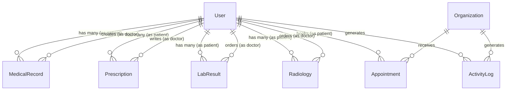
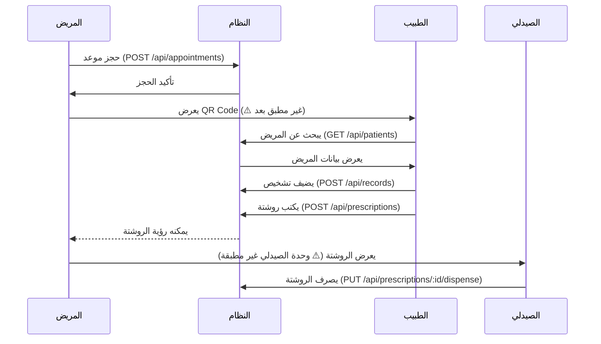
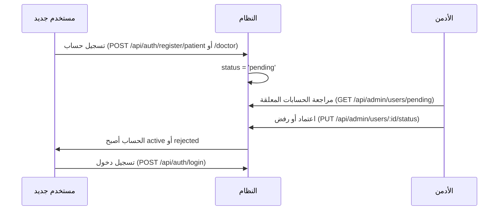

# 🏥 تحليل شامل لمشروع السجل الطبي الموحد (UMR / MedCore)

> **تاريخ التحليل:** 2026-04-09  
> **الغرض:** مرجع كامل للمشروع - يمكن الرجوع إليه في أي وقت بدلاً من إعادة التحليل

---

## 1. نظرة عامة على المشروع

| البند | التفاصيل |
|-------|----------|
| **الاسم** | MedCore — Unified Medical Record (UMR) |
| **النوع** | مشروع تخرج — منصة سجل طبي رقمي موحد |
| **الهدف** | حل مشكلة تشتت السجلات الطبية في مصر عبر QR Code ذكي لكل مريض |
| **الحالة** | قيد التطوير — الأساسيات موجودة، بعض الميزات ناقصة |

### الفكرة الأساسية
- كل مريض له **QR Code ذكي** يسمح للأطباء المعتمدين بالوصول لتاريخه الطبي الموحد
- مهم جداً في حالات **الطوارئ** (حساسيات، أمراض مزمنة، فصيلة الدم)
- يمنع **تكرار الفحوصات** عبر توحيد السجل الطبي

---

## 2. التقنيات المستخدمة (Tech Stack)

### Backend
| التقنية | الإصدار | الاستخدام |
|---------|---------|-----------|
| Node.js + Express.js | `express@4.18.2` | الخادم الأساسي |
| MongoDB + Mongoose | `mongoose@8.0.0` | قاعدة البيانات (Atlas) |
| JWT | `jsonwebtoken@9.0.2` | المصادقة |
| bcryptjs | `@3.0.3` | تشفير كلمات المرور |
| Multer | `@1.4.5-lts.1` | رفع الملفات |
| Helmet | `@8.1.0` | أمان HTTP Headers |
| express-rate-limit | `@8.2.1` | تحديد عدد الطلبات |
| express-validator | `@7.3.1` | التحقق من المدخلات |
| mongo-sanitize | `@1.1.0` | حماية من NoSQL Injection |
| cors | `@2.8.5` | التحكم في الـ Cross-Origin |

### Frontend
| التقنية | الإصدار | الاستخدام |
|---------|---------|-----------|
| React | `@18.3.1` | المكتبة الأساسية |
| Vite | `@7.3.1` | أداة البناء |
| Tailwind CSS | `@3.4.14` | التنسيق |
| React Router DOM | `@6.28.0` | التوجيه |
| Axios | `@1.7.7` | طلبات HTTP |
| Radix UI | عدة حزم | مكونات UI أساسية (Label, Select, Tabs, etc.) |
| Lucide React | `@0.454.0` | الأيقونات |
| Sonner | `@1.7.1` | إشعارات Toast |
| class-variance-authority | `@0.7.1` | إدارة أنماط المكونات |

### الاستضافة والنشر
| الخدمة | الاستخدام |
|--------|-----------|
| **Vercel** | استضافة Frontend |
| **Render** | استضافة Backend |
| **MongoDB Atlas** | قاعدة البيانات السحابية |

---

## 3. هيكل المشروع (Project Structure)

```
📁 Unified Digital Medical Record System/
├── 📁 backend/
│   ├── 📁 controllers/          # Business Logic (9 ملفات)
│   │   ├── adminController.js       (742 سطر — الأكبر)
│   │   ├── appointmentController.js (184 سطر)
│   │   ├── authController.js        (461 سطر)
│   │   ├── bookingController.js     (96 سطر)
│   │   ├── labController.js         (133 سطر)
│   │   ├── patientController.js     (202 سطر)
│   │   ├── prescriptionController.js(150 سطر)
│   │   ├── radiologyController.js   (135 سطر)
│   │   └── recordController.js      (78 سطر)
│   ├── 📁 middleware/           # وسطيات Express (5 ملفات)
│   │   ├── auth.js                  # التحقق من JWT
│   │   ├── errorHandler.js         # معالج الأخطاء العام
│   │   ├── role.js                 # RBAC — التحقق من الأدوار
│   │   ├── upload.js               # Multer — رفع الملفات
│   │   └── validate.js             # express-validator
│   ├── 📁 models/               # Mongoose Schemas (8 نماذج)
│   │   ├── ActivityLog.js
│   │   ├── Appointment.js
│   │   ├── LabResult.js
│   │   ├── MedicalRecord.js
│   │   ├── Organization.js
│   │   ├── Prescription.js
│   │   ├── Radiology.js
│   │   └── User.js
│   ├── 📁 routes/               # تعريف الـ Endpoints (9 ملفات)
│   │   ├── adminRoutes.js
│   │   ├── appointmentRoutes.js
│   │   ├── authRoutes.js
│   │   ├── bookingRoutes.js
│   │   ├── labRoutes.js
│   │   ├── patientRoutes.js
│   │   ├── prescriptionRoutes.js
│   │   ├── radiologyRoutes.js
│   │   └── recordRoutes.js
│   ├── 📁 scripts/
│   │   └── seedAdmin.js            # إنشاء حساب أدمن أولي
│   ├── 📁 utils/
│   │   ├── activityLogger.js       # تسجيل الأنشطة
│   │   └── safeObjectId.js        # التحقق من MongoDB ObjectId
│   ├── server.js                   # نقطة الدخول (203 سطر)
│   └── package.json
│
├── 📁 frontend/
│   ├── 📁 src/
│   │   ├── 📁 pages/           # الصفحات (17 صفحة)
│   │   │   ├── AdminPage.jsx        (47KB — أكبر ملف)
│   │   │   ├── RegisterPage.jsx     (26KB)
│   │   │   ├── HomePage.jsx         (16KB)
│   │   │   ├── ProfilePage.jsx      (16KB)
│   │   │   ├── HospitalPage.jsx     (15KB)
│   │   │   ├── LabPage.jsx          (15KB)
│   │   │   ├── LoginPage.jsx        (13KB)
│   │   │   ├── PatientPage.jsx      (12KB)
│   │   │   ├── DoctorPage.jsx       (12KB)
│   │   │   ├── PatientProfile.jsx   (10KB)
│   │   │   ├── Medications.jsx      (9KB)
│   │   │   ├── Patients.jsx         (5KB)
│   │   │   ├── Setting.jsx          (4KB)
│   │   │   ├── DashboardPage.jsx    (4KB)
│   │   │   ├── Labs.jsx             (2KB)
│   │   │   ├── Consents.jsx         (2KB)
│   │   │   └── NotFoundPage.jsx     (1KB)
│   │   ├── 📁 components/
│   │   │   ├── 📁 ui/          # 12 مكون UI قابل لإعادة الاستخدام
│   │   │   │   ├── badge.jsx, button.jsx, card.jsx, field.jsx
│   │   │   │   ├── input.jsx, label.jsx, loader.jsx, select.jsx
│   │   │   │   ├── separator.jsx, spinner.jsx, table.jsx, tabs.jsx
│   │   │   ├── 📁 modals/      # 6 نوافذ منبثقة
│   │   │   │   ├── AddLabResultModal.jsx
│   │   │   │   ├── AddPatientModal.jsx
│   │   │   │   ├── AddPrescriptionModal.jsx
│   │   │   │   ├── AddVisitModal.jsx (فارغ!)
│   │   │   │   ├── BookAppointmentModal.jsx
│   │   │   │   └── ViewIdModal.jsx
│   │   │   ├── 📁 admin/       # 4 مكونات خاصة بالأدمن
│   │   │   │   ├── EditOrgModal.jsx
│   │   │   │   ├── EditUserModal.jsx
│   │   │   │   ├── ViewOrgModal.jsx
│   │   │   │   └── ViewUserModal.jsx
│   │   │   ├── 📁 layout/      # التخطيط العام
│   │   │   │   ├── DashboardLayout.jsx
│   │   │   │   └── MainLayout.jsx
│   │   │   └── ErrorBoundary.jsx
│   │   ├── 📁 context/
│   │   │   └── AuthContext.jsx      # إدارة حالة المصادقة
│   │   ├── 📁 services/
│   │   │   └── api.js               # Axios Instance
│   │   ├── 📁 router/
│   │   │   └── AppRouter.jsx        # التوجيه
│   │   ├── 📁 lib/
│   │   │   └── utils.js             # cn() utility
│   │   ├── 📁 hooks/                # فارغ حالياً!
│   │   ├── App.jsx
│   │   └── main.jsx
│   ├── vite.config.js
│   ├── tailwind.config.js
│   ├── vercel.json
│   └── package.json
│
├── 📁 docs/
│   └── كتاب المشروع.docx           # كتاب المشروع الأكاديمي
└── 📁 database/
    └── New Text Document.txt        # فارغ
```

---

## 4. نماذج قاعدة البيانات (Database Models) — تفصيل كامل

### 4.1 User (المستخدم) — الأهم
```
الحقول المشتركة:
  - fullName (String, required)
  - email (String, required, unique, lowercase)
  - role: ['patient', 'doctor', 'hospital', 'lab', 'super_admin', 'sub_admin']
  - isVerified (Boolean, default: false)
  - status: ['pending', 'active', 'rejected'] (default: 'pending')
  - nationalId (String, unique, sparse — مطلوب لغير الأدمنز)
  - phoneNumber (String, required)
  - gender: ['male', 'female']

حقول المريض فقط:
  - mothersName (required for patient — يُستخدم كسؤال أمان)
  - idDocumentPath (required — صورة البطاقة)
  - dateOfBirth (Date)
  - bloodType: ['A+', 'A-', 'B+', 'B-', 'AB+', 'AB-', 'O+', 'O-', 'unknown']
  - allergies [String]
  - chronicDiseases [String]

حقول الطبيب فقط:
  - syndicateNumber (required — يُستخدم كسؤال أمان)
  - specialty (String)
  - syndicateIdPath (required — صورة كارنيه النقابة)

الفهارس: { role: 1 }
```

> [!IMPORTANT]
> **لا يوجد حقل password في User Model!** تم إزالته. تسجيل الدخول يتم عبر `email + nationalId` فقط (بدون كلمة مرور).

### 4.2 MedicalRecord (السجل الطبي / الزيارة)
```
  - patientId → User (required)
  - doctorId → User (required)
  - diagnosis (String, required)
  - notes (String)
  - visitDate (Date, default: now)
  الفهارس: { patientId: 1, visitDate: -1 }
```

### 4.3 Prescription (الروشتة)
```
  - patientId → User (required)
  - doctorId → User (required)
  - medication (String, required)
  - dose (String, required)
  - duration (String, required)
  - status: ['pending', 'dispensed'] (default: 'pending')
  الفهارس: { patientId: 1, createdAt: -1 }
```

### 4.4 LabResult (نتيجة تحليل)
```
  - patientId → User (required)
  - doctorId → User (required)
  - testName (String, required)
  - result (String, required)
  - date (Date, default: now)
  - labName (String)
  - filePath (String — ملف مرفق)
  الفهارس: { patientId: 1, date: -1 }, { doctorId: 1, date: -1 }
```

### 4.5 Radiology (أشعة)
```
  - patientId → User (required)
  - doctorId → User (required)
  - scanType (String, required)
  - imagePath (String — صورة الأشعة)
  - report (String)
  - date (Date, default: now)
  الفهارس: { patientId: 1, date: -1 }, { doctorId: 1, date: -1 }
```

### 4.6 Appointment (حجز موعد)
```
  - patient → User (required)
  - doctor → User (optional)
  - hospital → Organization (optional)
  - lab → Organization (optional)
  - specialty (String)
  - date (Date, required)
  - time (String, required)
  - type: ['كشف جديد', 'استشارة', 'متابعة']
  - reason (String, maxlength: 100)
  - status: ['قيد الانتظار', 'مؤكد', 'مكتمل', 'ملغي'] (default: 'قيد الانتظار')
  - notes (String)
  الفهارس: { patient, date }, { doctor, date }, { hospital, date }
```

### 4.7 Organization (منظمة — مستشفى أو مختبر)
```
  - name (String, required)
  - type: ['hospital', 'lab'] (required)
  - email (String, required, unique)
  - healthRegNumber (String, required, unique — رقم تسجيل الصحة)
  - phoneNumber (String, required)
  - address, city (String)
  - status: ['active', 'inactive', 'pending']
  حقول المستشفى: bedCount, departmentCount
  حقول المختبر: testTypes [String]
  إضافية: description, licenseExpiry
```

### 4.8 ActivityLog (سجل النشاط)
```
  - action (String, required)
  - userId → User
  - organizationId → Organization
  - targetType: ['user', 'organization', 'patient', 'prescription', 'lab_result', 'appointment', 'system']
  - targetId (ObjectId)
  - details (String)
  - ipAddress (String)
  - timestamps: true (createdAt, updatedAt)
```

### مخطط العلاقات بين النماذج


---

## 5. جميع الـ API Endpoints — تفصيل كامل

### 5.1 Auth Routes (`/api/auth`)
| Method | Endpoint | الوصف | الحماية |
|--------|----------|-------|---------|
| `POST` | `/register/patient` | تسجيل مريض جديد (مع رفع صورة البطاقة) | Rate Limit + Validation |
| `POST` | `/register/doctor` | تسجيل طبيب جديد (مع صورة كارنيه النقابة) | Rate Limit + Validation |
| `POST` | `/login` | تسجيل دخول (أفراد ومنظمات) | Rate Limit (10/دقيقة) |
| `GET` | `/me` | جلب بيانات المستخدم الحالي | JWT Auth |
| `POST` | `/recover-email` | استرجاع الإيميل (عبر الرقم القومي + سؤال أمان) | Rate Limit (5/15 دقيقة) |
| `PUT` | `/profile` | تحديث الملف الشخصي | JWT Auth |

#### آلية تسجيل الدخول:
- **الأفراد (patient/doctor/admin):** `email + nationalId` → بدون كلمة مرور!
- **المنظمات (hospital/lab):** `email + healthRegNumber`
- **JWT Token:** صلاحية يوم واحد، مع `issuer: "umr-api"` و `audience: "umr-client"`

### 5.2 Patient Routes (`/api/patients`)
| Method | Endpoint | الوصف | الحماية |
|--------|----------|-------|---------|
| `POST` | `/` | إضافة مريض جديد | Auth + Doctor/Admin |
| `GET` | `/` | قائمة المرضى (مع بحث وتصفح) | Auth + Doctor/Admin |
| `GET` | `/:id` | بيانات مريض واحد | Auth + Self/Doctor/Admin |
| `PUT` | `/:id` | تعديل مريض | Auth + Self/Doctor/Admin |
| `DELETE` | `/:id` | حذف مريض | Auth + Admin فقط |

### 5.3 Records Routes (`/api/records`)
| Method | Endpoint | الوصف | الحماية |
|--------|----------|-------|---------|
| `POST` | `/` | إنشاء سجل طبي | Auth + Doctor |
| `GET` | `/:patientId` | سجلات مريض معيّن | Auth + Doctor/Patient |

### 5.4 Prescription Routes (`/api/prescriptions`)
| Method | Endpoint | الوصف | الحماية |
|--------|----------|-------|---------|
| `POST` | `/` | كتابة روشتة | Auth + Doctor |
| `GET` | `/` | كل الروشتات | Auth + Doctor/Admin |
| `GET` | `/:patientId` | روشتات مريض | Auth |
| `PUT` | `/:id/dispense` | صرف الروشتة | Auth + Admin |

### 5.5 Lab Routes (`/api/labs`)
| Method | Endpoint | الوصف | الحماية |
|--------|----------|-------|---------|
| `POST` | `/` | إضافة نتيجة تحليل | Auth + Doctor/Admin |
| `GET` | `/` | قائمة التحاليل (حسب الدور) | Auth |
| `DELETE` | `/:id` | حذف تحليل | Auth + Owner/Admin |

### 5.6 Radiology Routes (`/api/radiology`)
| Method | Endpoint | الوصف | الحماية |
|--------|----------|-------|---------|
| `POST` | `/` | إضافة نتيجة أشعة | Auth + Doctor/Admin |
| `GET` | `/` | قائمة الأشعة | Auth |
| `DELETE` | `/:id` | حذف أشعة | Auth + Owner/Admin |

### 5.7 Appointment Routes (`/api/appointments`)
| Method | Endpoint | الوصف | الحماية |
|--------|----------|-------|---------|
| `GET` | `/` | قائمة المواعيد (حسب الدور) | Auth |
| `POST` | `/` | حجز موعد جديد | Auth (Patient) |
| `PATCH` | `/:id/status` | تحديث حالة الموعد | Auth + Owner/Admin |

### 5.8 Booking Routes (`/api/booking`)
| Method | Endpoint | الوصف | الحماية |
|--------|----------|-------|---------|
| `GET` | `/providers` | قائمة مقدمي الخدمة النشطين | Auth |
| `GET` | `/available-slots` | المواعيد المتاحة ليوم معين | Auth |

### 5.9 Admin Routes (`/api/admin`)
| Method | Endpoint | الوصف | الحماية |
|--------|----------|-------|---------|
| `GET` | `/stats` | إحصائيات المنصة | Admin Auth |
| `GET` | `/users` | قائمة المستخدمين | Admin Auth |
| `POST` | `/users` | إضافة مستخدم | Admin Auth |
| `GET` | `/users/pending` | المستخدمين المعلقين | Admin Auth |
| `GET` | `/user/:id` | تفاصيل مستخدم | Admin Auth |
| `PUT` | `/user/:id` | تعديل مستخدم | Admin Auth |
| `PUT` | `/users/:id/status` | تغيير حالة مستخدم | Admin Auth |
| `DELETE` | `/user/:id` | حذف مستخدم | Super Admin فقط |
| `GET` | `/doctors` | قائمة الأطباء | Admin Auth |
| `PUT` | `/verify-doctor/:id` | اعتماد طبيب | Admin Auth |
| `GET` | `/organizations` | قائمة المنظمات | Admin Auth |
| `POST` | `/organizations` | إضافة منظمة | Admin Auth |
| `GET` | `/organization/:id` | تفاصيل منظمة | Admin Auth |
| `PUT` | `/organization/:id` | تعديل منظمة | Admin Auth |
| `PUT` | `/organizations/:id/status` | تغيير حالة منظمة | Admin Auth |
| `DELETE` | `/organization/:id` | حذف منظمة | Super Admin فقط |
| `GET` | `/activity-log` | سجل النشاط | Admin Auth |
| `DELETE` | `/activity-log` | مسح سجل النشاط | Super Admin فقط |

---

## 6. نظام المصادقة والصلاحيات (Authentication & RBAC)

### 6.1 الأدوار (Roles)
```
patient     → مريض      → يرى بياناته فقط، يحجز مواعيد
doctor      → طبيب      → يضيف تشخيصات، روشتات، تحاليل، أشعة
hospital    → مستشفى    → يدخل كمنظمة (email + healthRegNumber)
lab         → مختبر     → يدخل كمنظمة
super_admin → مدير عام  → صلاحيات كاملة (حذف مستخدمين، منظمات، سجلات)
sub_admin   → مدير مساعد → نفس صلاحيات الأدمن ما عدا الحذف
```

### 6.2 طبقات الحماية (Middleware Pipeline)
```
Request → Rate Limiter → Body Validation → JWT Auth → Role Check → Controller
```

1. **Rate Limiting:** عام (100 طلب / 15 دقيقة) + خاص (login: 10/دقيقة، register: 20/15 دقيقة)
2. **express-validator:** التحقق من المدخلات في الـ Routes
3. **auth.js:** فك تشفير JWT والتحقق من صلاحيته
4. **role.js:** ثلاث وسطيات:
   - `requireRole(...roles)` — التحقق من الدور
   - `requirePatientSelf` — المريض يرى بياناته فقط
   - `authorizeSuperAdmin` — عمليات الحذف للسوبر أدمن فقط
5. **requireObjectId()** — التحقق من صحة MongoDB ID

### 6.3 آلية JWT
```javascript
// Payload للأفراد:
{ userId: ObjectId, role: String }

// Payload للمنظمات:
{ orgId: ObjectId, role: String, loginType: "organization" }

// Options:
{ expiresIn: "1d", issuer: "umr-api", audience: "umr-client" }
```

---

## 7. بنية الـ Frontend — تفصيل

### 7.1 نظام التوجيه (Routing)

```
/                  → الصفحة الرئيسية (عامة)
/login             → تسجيل الدخول (عامة — PublicOnly guard)
/register          → التسجيل (عامة — PublicOnly guard)
/dashboard         → لوحة التحكم العامة (RequireAuth)
/profile           → الملف الشخصي (RequireAuth)
/patient           → لوحة المريض (RequireRole: patient)
/doctor            → لوحة الطبيب (RequireRole: doctor)
/hospital          → لوحة المستشفى (RequireRole: hospital)
/lab               → لوحة المختبر (RequireRole: lab)
/admin             → لوحة الإدارة (RequireRole: admin/super_admin/sub_admin)
*                  → صفحة 404
```

### 7.2 Guards (حراس التوجيه)
- **RequireAuth:** يعيد توجيه لـ `/login` إذا مفيش مستخدم
- **RequireRole:** يعيد توجيه لـ `/dashboard` إذا الدور غلط
- **PublicOnly:** يعيد توجيه لـ `/dashboard` إذا المستخدم مسجل دخول

### 7.3 إدارة الحالة (State Management)
- **AuthContext:** يدير حالة المستخدم (`user`, `isLoading`, `login`, `logout`)
- **localStorage:** يخزن `umr_token` و `umr_user`
- **Axios Interceptors:** يضيف JWT تلقائياً لكل طلب، وعند 401 يعيد توجيه لـ `/login`

### 7.4 الصفحات الرئيسية وأحجامها
| الصفحة | الحجم | الوظيفة |
|--------|-------|---------|
| AdminPage | **47KB** | إدارة المستخدمين، المنظمات، الإحصائيات، سجل النشاط (الأكثر تعقيداً) |
| RegisterPage | 26KB | نموذج تسجيل (مريض/طبيب) مع رفع ملفات |
| HomePage | 16KB | الصفحة الهبوط (Landing Page) |
| ProfilePage | 16KB | عرض وتعديل الملف الشخصي |
| HospitalPage | 15KB | لوحة تحكم المستشفى |
| LabPage | 15KB | لوحة تحكم المختبر |
| LoginPage | 13KB | صفحة تسجيل الدخول |
| PatientPage | 12KB | لوحة تحكم المريض |
| DoctorPage | 12KB | لوحة تحكم الطبيب |

---

## 8. نظام الأمان (Security Analysis)

### ✅ ما هو موجود ويعمل جيداً
1. **JWT مع issuer/audience** — حماية قوية ضد token misuse
2. **Rate Limiting** — عام + متخصص (login, register, recover)
3. **Helmet** — أمان HTTP Headers
4. **CORS مقيد** — origins محددة مسبقاً
5. **express-validator** — تحقق من المدخلات في الـ Routes
6. **mongo-sanitize** — في recover-email endpoint
7. **Multer file filter** — فقط JPG, PNG, PDF  (5MB max)
8. **ObjectId validation** — يمنع crash على IDs خاطئة
9. **Activity Logging** — تسجيل العمليات الحساسة
10. **RBAC متعدد الطبقات** — requireRole, requirePatientSelf, authorizeSuperAdmin
11. **Error Handler** — لا يكشف stack trace في production

### ⚠️ ثغرات ومشاكل أمنية

> [!WARNING]
> **1. لا يوجد Password!**
> تسجيل الدخول يتم عبر `email + nationalId` فقط. أي شخص يعرف الرقم القومي والإيميل يمكنه الدخول. هذا خطر أمني كبير.

> [!WARNING]
> **2. موقع الـ Uploads غير محمي في Production**
> في `server.js` سطر 132-135: الـ uploads يتم تقديمها كـ static files بدون authentication middleware (تم إنشاء `authenticateUploads` لكن لم يتم تطبيقه!). أي شخص يعرف مسار الملف يمكنه الوصول إليه.

> [!CAUTION]
> **3. seedAdmin.js يستخدم password field (متناقض)**
> الـ seed script يحاول إنشاء admin بـ password رغم أن الـ User model لا يحتوي على password field. هذا يعني الـ seed script لن يعمل بشكل صحيح.

> [!WARNING]
> **4. patientController.createPatient يستخدم bcrypt (متناقض)**
> الـ `createPatient` في `patientController.js` يستورد `bcryptjs` ويشفر كلمة مرور عشوائية رغم عدم وجود password field في الـ Model.

---

## 9. الأخطاء البرمجية المكتشفة (Bugs Found)

### 🔴 أخطاء حرجة (Critical)

| # | الملف | المشكلة |
|---|-------|---------|
| 1 | `middleware/upload.js` vs `server.js` | `authenticateUploads` middleware تم تعريفه في `server.js` (سطر 109-130) لكن **لم يتم تطبيقه** على route الـ uploads (سطر 132-135). الملفات المرفوعة متاحة بدون authentication |
| 2 | `controllers/patientController.js` | يستورد `bcryptjs` و `crypto` ويحسب `hashedPassword` ويحاول حفظه رغم عدم وجود `password` field في `User.js` — كود ميت وغير فعال |
| 3 | `scripts/seedAdmin.js` | يحاول إنشاء admin بـ `role: 'admin'` لكن الـ User model الحالي roles لا تحتوي على `'admin'` مباشرة (الأدوار هي `super_admin` و `sub_admin`). أيضاً يحاول حفظ password |
| 4 | `routes/patientRoutes.js` | `requireRole("admin")` — لا يوجد role بالضبط اسمه `"admin"` في الـ schema. المفروض يكون `"super_admin", "sub_admin"` |
| 5 | `components/modals/AddVisitModal.jsx` | ملف فارغ (0 bytes) — لن يعمل |

### 🟡 مشاكل متوسطة (Medium)

| # | الملف | المشكلة |
|---|-------|---------|
| 6 | `controllers/labController.js` | في `getLabResults`، يتحقق من role `"admin"` بدلاً من `"super_admin"/"sub_admin"` — الأدمنز الحقيقيون لن يصلوا |
| 7 | `controllers/radiologyController.js` | نفس مشكلة #6 — يتحقق من `"admin"` فقط |
| 8 | `controllers/appointmentController.js` | في `getAppointments`، يتحقق من `req.user.userId` للـ hospital/lab لكنهم يسجلون دخول كمنظمات (orgId وليس userId) |
| 9 | `frontend/src/hooks/` | مجلد فارغ — لم يتم إنشاء أي custom hooks |
| 10 | `frontend/src/pages/DashboardPage.jsx` | يتحقق مرة ثانية من `!user` والتوجيه لـ `/login` رغم أن `RequireAuth` guard يفعل نفس الشيء بالفعل |

### 🟢 ملاحظات طفيفة (Minor)

| # | الملف | المشكلة |
|---|-------|---------|
| 11 | Response messages | خليط بين العربية والإنجليزية في رسائل الـ API — غير متسق |
| 12 | `database/` folder | يحتوي على ملف نصي فارغ فقط — لا فائدة منه |
| 13 | Root `package.json` | الـ root package.json لا يحتوي على scripts مفيدة — فقط `"name": "medcore"` |

---

## 10. الميزات الموجودة vs الناقصة

### ✅ ميزات مكتملة ومتاحة
- [x] تسجيل مريض وطبيب (مع رفع مستندات)
- [x] تسجيل دخول أفراد ومنظمات
- [x] لوحة تحكم أدمن كاملة (CRUD مستخدمين ومنظمات)
- [x] إدارة السجلات الطبية (إضافة/عرض)
- [x] إدارة الروشتات (إضافة/عرض/صرف)
- [x] إدارة التحاليل (إضافة/عرض/حذف)
- [x] إدارة الأشعة (إضافة/عرض/حذف)
- [x] نظام حجز المواعيد (مع التحقق من التعارض)
- [x] نظام مقدمي الخدمة والمواعيد المتاحة
- [x] نظام اعتماد الأطباء
- [x] سجل النشاط (Activity Log)
- [x] استرجاع الإيميل عبر سؤال أمان
- [x] تعديل الملف الشخصي
- [x] RBAC متعدد الطبقات
- [x] Error Boundary في الـ Frontend
- [x] Responsive Sidebar + Mobile overlay

### ❌ ميزات ناقصة ومحتاج تتعمل
- [ ] **وحدة الصيدلي (Pharmacist Module)** — لا يوجد PharmacistPage أو controller
- [ ] **QR Code Scanner** — غير متاح في الواجهة
- [ ] **Emergency Access View** — وصول الطوارئ بدون تسجيل دخول
- [ ] **AI Chatbot** — مساعد ذكي للمريض
- [ ] **OCR لرقمنة السجلات القديمة** — غير مطبق
- [ ] **Smart Notifications** — تذكيرات الأدوية
- [ ] **تطبيق موبايل (React Native)** — غير مبدوء
- [ ] **نظام Consent (الموافقة)** — صفحة `Consents.jsx` موجودة لكن بسيطة جداً
- [ ] **تقارير PDF** — لا يوجد report generation
- [ ] **Dashboard Analytics** — إحصائيات بصرية (charts)

---

## 11. تدفق العمل الأساسي (Core Workflows)

### 11.1 تدفق الزيارة الطبية


### 11.2 تدفق التسجيل والاعتماد


---

## 12. ملخص الإحصائيات

| المقياس | العدد |
|---------|-------|
| **نماذج قاعدة البيانات** | 8 |
| **Controllers** | 9 |
| **Route Files** | 9 |
| **API Endpoints** | ~40 |
| **Middleware** | 5 |
| **صفحات Frontend** | 17 |
| **مكونات UI** | 12 |
| **Modal Components** | 10 (6 modals + 4 admin) |
| **إجمالي Frontend** | ~22 component |
| **أسطر Backend** | ~2,500+ |
| **أسطر Frontend** | ~5,000+ |

---

## 13. ملاحظات للمناقشة (Discussion Panel Ready)

### نقاط القوة لو سألك الدكتور
1. **RBAC متعدد الطبقات:** ثلاث وسطيات مختلفة للصلاحيات
2. **Activity Logging:** كل عملية حساسة يتم تسجيلها
3. **Rate Limiting:** حماية من brute force
4. **Pagination:** كل الـ list endpoints مع تصفح
5. **Error Handling:** معالج شامل لأنواع مختلفة من الأخطاء
6. **Input Validation:** على مستوى الـ Routes (express-validator)
7. **Safe ObjectId:** حماية من crash عند IDs خاطئة
8. **Dual Login:** نظام دخول مزدوج (أفراد + منظمات)

### نقاط ممكن تتسأل عليها
1. **ليه مفيش Password?** — قرار تصميمي (National ID بيكفي كـ authentication factor)
2. **ليه Uploads مش محمية؟** — باج محتاج يتصلح
3. **ليه مفيش QR Scanner؟** — مخطط لكن لم يُنفذ بعد
4. **ليه خليط عربي/إنجليزي؟** — بدأ إنجليزي وتم تعريب تدريجياً

---

> [!TIP]
> هذا الملف مرجع كامل — كل ما تحتاج تسأل عنه موجود هنا. قولي أي جزء عايز نتعمق فيه أكتر! 🚀
